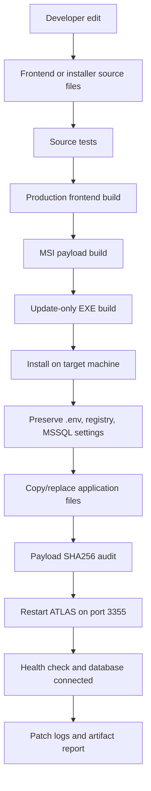

# ATLAS Future Edit Tracking Guide

## Current Verified Build

| Item | Value |
| --- | --- |
| Local repository | `C:\Airfare_Allowance` |
| Active branch | `codex/atlas-installer-2.2.8` |
| Latest tracked commit | `0b0953531e7c995d4f18b786628078d05bd96923` |
| App URL | `http://127.0.0.1:3355/` |
| Health URL | `http://127.0.0.1:3355/api/health` |
| Backup branch | `backup/old-layout-baseline` |
| Backup baseline commit | `ed0a8d4` |
| Latest EXE patch | `C:\Airfare_Allowance\artifacts\patch-2.3.53\ATLAS-Airfare-Allowance-UpdateOnly-2.3.53-x64.exe` |
| Latest MSI payload | `C:\Airfare_Allowance\artifacts\patch-2.3.53\ATLAS-Airfare-Allowance-2.3.53-x64.msi` |

## Main Edit Map

| Area | Primary files | Purpose | Edit risk | Required tests |
| --- | --- | --- | --- | --- |
| Frontend screen logic | `atlas-hcm-next\app\page.tsx` | Main UI state, forms, Employee Self-Service approval flow, allocation links | Medium | `npm test`, `npm run build` inside `atlas-hcm-next` |
| Frontend visual layout | `atlas-hcm-next\app\globals.css` | HD layout, sidebar, cards, 3D depth, RTL/LTR styling | Medium | `npm run test:ui-layout`, `npm run test:frontend-verification` |
| API helper | `atlas-hcm-next\lib\atlas-api.ts` | Frontend-to-backend request wrapper | High | `npm test`, live `3355` check |
| Backend API | `server.js` | Routes, controllers, validation, database access | High | `npm run check`, `npm run test:full` |
| Database SQL | `database\*.sql`, `extensions\employee-portal\sql\*.sql` | Schema, procedures, functions, repair scripts | Critical | SQL-specific tests plus live health check |
| Installer MSI | `installer\Build-ATLAS-MSI.ps1` | Builds MSI payload and file manifest | High | Build MSI, verify SHA256 |
| Installer EXE patch | `installer\bootstrapper\deploy.ps1`, `installer\bootstrapper\Bundle.wxs` | Update-only patch, dependency logs, overwrite verification | High | `node tests/atlas-patch-artifact.test.js`, build EXE |
| Patch documentation | `docs\ATLAS_Patch_2.3.53_Artifact.md` | Release evidence and artifact hashes | Low | Manual review |

## Recent Change History

| Commit | Type | Summary | Important files |
| --- | --- | --- | --- |
| `0b09535` | `feat(installer)` | Added verified update patch artifacts, dependency map, replacement audit | `installer\bootstrapper\deploy.ps1`, `tests\atlas-patch-artifact.test.js`, `docs\ATLAS_Patch_2.3.53_Artifact.md` |
| `9baa90f` | `fix(ess)` | Clarified approved request workflow and visible allocation link | `atlas-hcm-next\app\page.tsx`, `atlas-hcm-next\app\globals.css`, `tests\employee-self-service-allocation-link.test.js` |
| `cca698b` | `test(frontend)` | Verified theme and 3D layout contract | Frontend tests |
| `50d54f2` | `feat(theme)` | Added dynamic 3D preference engine | Frontend theme files |
| `d26da08` | `feat(ui)` | Implemented HD responsive layout overhaul | Frontend UI files |
| `96eb390` | `chore(backup)` | Captured old layout baseline | Git backup/history |

## Visual Dependency Flow

## Approval Workflow Linkage

| Step | User action | Existing system action | File reference |
| --- | --- | --- | --- |
| 1 | Open Employee Self-Service request | UI loads request review card | `atlas-hcm-next\app\page.tsx` |
| 2 | Click `Approve request` | Calls existing transition API | `transitionSelfServiceRequest` in `page.tsx` |
| 3 | Backend approves request | Creates or reuses linked allocation | `createAllocationFromSelfServiceRequest` in `server.js` |
| 4 | Backend returns `LinkedAllocationID` | UI displays `Open allocation #...` | `page.tsx` review card |
| 5 | Already approved clicked again | UI shows already-approved message | `buildAlreadyApprovedMessage` in `page.tsx` |

## Patch Install Logging

| Log/artifact | Created by | Purpose |
| --- | --- | --- |
| `update-finalize-*.txt` | `deploy.ps1` | Main patch process report |
| `install_debug.log` | `deploy.ps1` | Structured step-by-step install debug events |
| `patch-dependency-map-*.md` | `New-AtlasPatchDependencyReport` | Human-readable dependency relationship map |
| `patch-dependency-map-*.json` | `New-AtlasPatchDependencyReport` | Machine-readable dependency relationship map |
| `patch-file-replacement-audit-*.csv` | `Invoke-PatchPayloadReplacementAudit` | Full copied/replaced file verification table |
| `patch-file-replacement-audit-*.json` | `Invoke-PatchPayloadReplacementAudit` | Replacement audit totals |
| `checksum-diagnostic-*.json` | `Invoke-ChecksumDiagnostic` | Installed file SHA256 and length verification |

## Standard Future Edit Process

| Phase | Action | Command or check |
| --- | --- | --- |
| 1 | Check working tree | `git status --short --branch` |
| 2 | Make scoped edit | Edit only related frontend/installer/backend files |
| 3 | Run source checks | `node tests/atlas-patch-artifact.test.js` and related test |
| 4 | Run frontend tests | `npm test` inside `atlas-hcm-next` |
| 5 | Run backend checks | `npm run check`, `npm run test:full` |
| 6 | Build frontend | `npm run build` inside `atlas-hcm-next` |
| 7 | Verify live app | `http://127.0.0.1:3355/api/health` |
| 8 | Build MSI if packaging | `installer\Build-ATLAS-MSI.ps1` |
| 9 | Build EXE if packaging | `installer\bootstrapper\deploy.ps1 -Mode Build -UpdateOnly` |
| 10 | Commit | Use conventional commit message |

## Verification Matrix

| Check | Expected result |
| --- | --- |
| `http://127.0.0.1:3355/` | HTTP `200` |
| `http://127.0.0.1:3355/api/health` | `status=healthy`, `database=connected` |
| Frontend build | Next.js build completes successfully |
| Frontend tests | All source/layout tests pass |
| Backend syntax | `node --check server.js` passes |
| Full system test | `ATLAS full system test PASSED` |
| Patch artifact test | `ATLAS patch artifact source checks passed` |
| EXE output | New `ATLAS-Airfare-Allowance-UpdateOnly-<version>-x64.exe` exists |
| MSI output | New `ATLAS-Airfare-Allowance-<version>-x64.msi` exists |

## Remote Repository Status

| Item | Status |
| --- | --- |
| Remote URL | Not configured |
| Current local path | `C:\Airfare_Allowance` |
| Add remote command | `git remote add origin https://github.com/<account>/<repo>.git` |
| Push command | `git push -u origin codex/atlas-installer-2.2.8` |

## Do Not Change Without Explicit Approval

| Protected area | Reason |
| --- | --- |
| Backend API payload shape | Existing frontend and installed customers rely on it |
| Database schema/data | Customer data preservation requirement |
| Port `3355` behavior | Existing deployment and shortcuts rely on it |
| `.env` and registry preservation | Patch must keep installed machine configuration |
| Backup branch | Rollback reference for old layout baseline |

