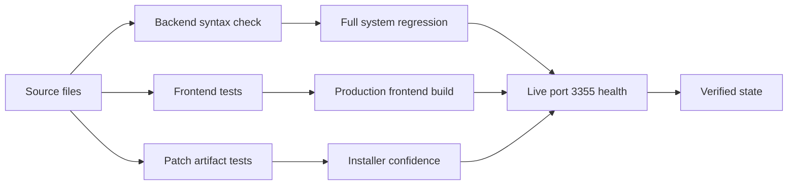

# ATLAS Test Verification Report

## Verification Snapshot

| Item | Result |
| --- | --- |
| Date | 2026-07-08 |
| Workspace | `C:\Airfare_Allowance` |
| Branch | `codex/atlas-installer-2.2.8` |
| Live app URL | `http://127.0.0.1:3355/` |
| Health URL | `http://127.0.0.1:3355/api/health` |
| Health status | `healthy` |
| Database status | `connected` |
| Self-service workflow marker | `phase2-same-port-allocation-link` |
| Payable report marker | `mssql-procedure-payable-bhd` |

## Test Results

| Test | Command | Result |
| --- | --- | --- |
| Backend syntax check | `npm run check` | Passed |
| Patch artifact contract | `node tests/atlas-patch-artifact.test.js` | Passed |
| Employee self-service allocation link | `node tests/employee-self-service-allocation-link.test.js` | Passed |
| Full system regression | `npm run test:full` | Passed |
| Frontend full test suite | `npm test` in `atlas-hcm-next` | Passed |
| Frontend production build | `npm run build` in `atlas-hcm-next` | Passed |
| Live root endpoint | `GET http://127.0.0.1:3355/` | HTTP `200` |
| Live health endpoint | `GET http://127.0.0.1:3355/api/health` | Healthy and database connected |

## Full System Test Artifacts

| Artifact | Path |
| --- | --- |
| Markdown report | `C:\Airfare_Allowance\test-reports\atlas-full-system-test-20260708062609.md` |
| JSON report | `C:\Airfare_Allowance\test-reports\atlas-full-system-test-20260708062609.json` |

## Verified Functional Areas

| Area | Verification coverage |
| --- | --- |
| Backend startup safety | `server.js` syntax check passed |
| Full system behavior | Full system regression passed |
| Airfare formulas | Frontend formula test passed |
| Employee import preview | Import parsing test passed |
| Employee dropdowns | Dropdown source test passed |
| Loan dashboard | Loan source test passed |
| Airfare attachments | Attachment source test passed |
| Company/report/backup flow | Source checks passed |
| Opening balance | Opening balance source test passed |
| UI layout | Layout source test passed |
| Frontend verification | Responsive layout and validation checks passed |
| Patch packaging logic | Installer artifact test passed |
| Self-service approval link | Allocation-link workflow source check passed |

## Live Port 3355 Result

```text
GET http://127.0.0.1:3355/
Result: 200

GET http://127.0.0.1:3355/api/health
Result: healthy
Database: connected
```

## Future Edit Tracking

Before the next edit:

| Step | Required action |
| --- | --- |
| 1 | Check `git status --short --branch` |
| 2 | Identify touched module in `docs\ATLAS_FUTURE_EDIT_TRACKING.md` |
| 3 | Make scoped changes only |
| 4 | Run the matching source test |
| 5 | Run `npm run check` |
| 6 | Run `npm test` in `atlas-hcm-next` if frontend changed |
| 7 | Run `npm run build` in `atlas-hcm-next` if frontend changed |
| 8 | Verify `http://127.0.0.1:3355/api/health` |
| 9 | Update the relevant artifact document |
| 10 | Commit with a conventional commit message |

## Verification Flow



## Status

```text
VERIFIED: Current workspace passes core backend, frontend, patch, build, and live port 3355 checks.
```
