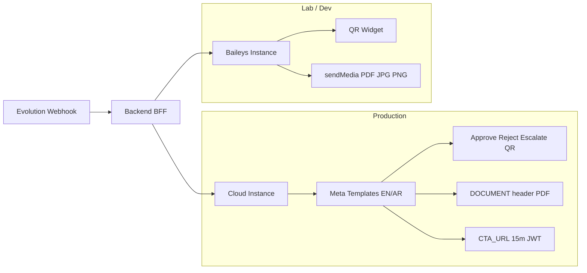
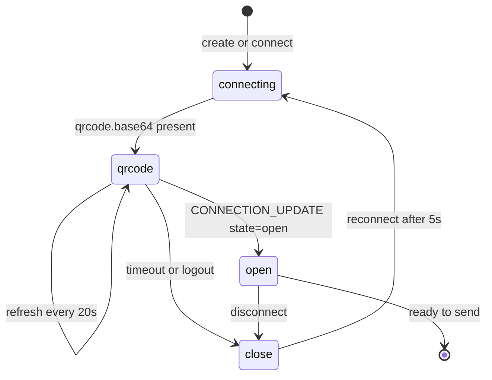
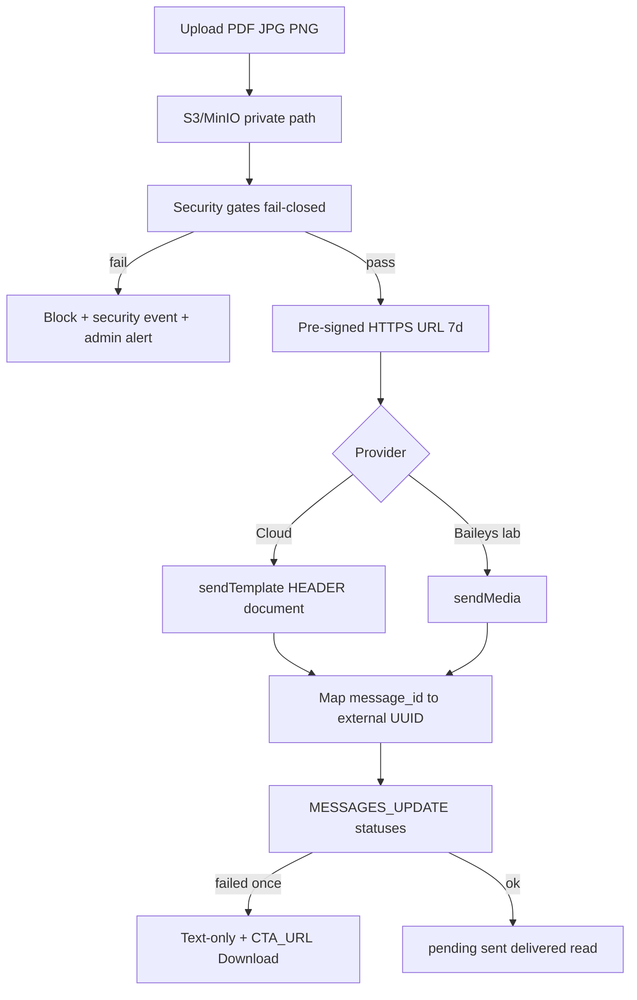
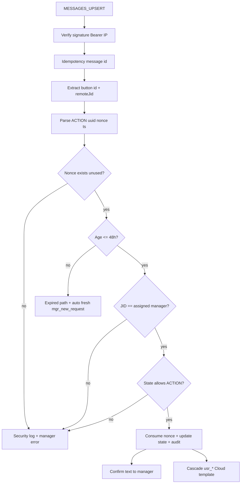
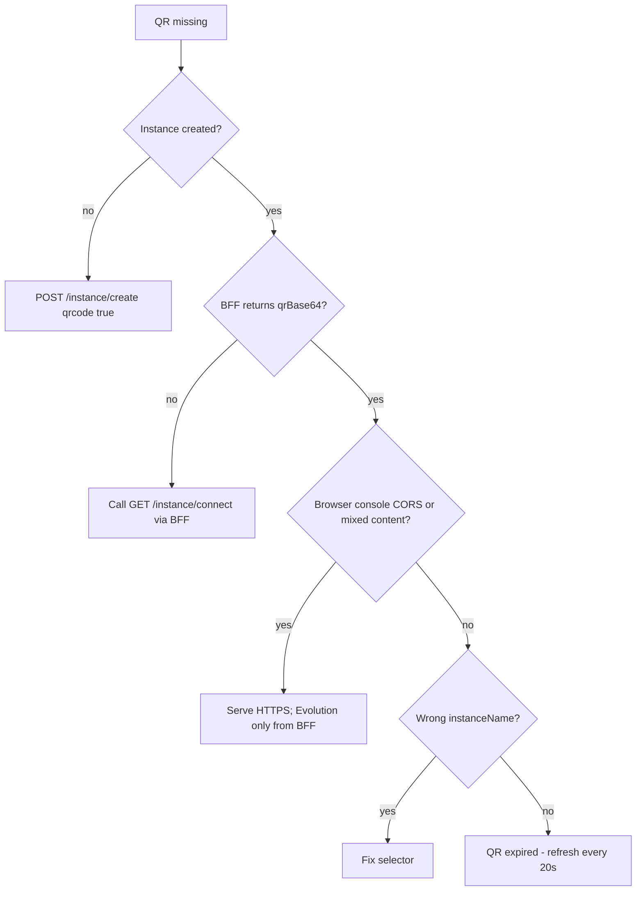

# WhatsApp Evolution API v2 — Implementation Specification

**Audience:** Frontend, backend, DevOps, QA  
**Mode:** Actionable implementation documentation (no DB schemas, no SQL, no framework code)  
**Platform:** Evolution API v2 · Dual provider (Baileys + Cloud / WhatsApp Business API)  
**Status:** Architecture LOCKED · Codebase currently has **zero** Evolution integration (wa.me deep-links only)

**Related:** Architecture decision lock in Cursor canvas `whatsapp-approval-template-system.canvas.tsx`  
**Companion:** Live connection playbook canvas `whatsapp-live-connection-playbook.canvas.tsx`

---

## 0. Decision lock (non-negotiable)

| # | Decision | Implementation implication |
|---|----------|----------------------------|
| 1 | Zero emojis in all templates | Plain-text urgency only; Meta copy and confirmations must contain no emoji |
| 2 | External IDs = UUIDv4 only | Never put sequential `REQ-*` on WhatsApp; internal map UUID ↔ internal key |
| 3 | Download / Share / Delegate = CTA_URL + JWT | Quick Reply only for Approve / Reject / Escalate / Snooze / Cancel / Extension |
| 4 | No CSV/XLSX on WhatsApp | Digest = PDF via portal or MARKETING text + Download Report CTA |
| 5 | 48h expiry alignment | Nonce action window, request action window, escalation timers: **48h** |
| 6 | EN and AR registered separately | Two Meta template names / language codes per logical template |
| 7 | Digests = MARKETING + STOP | Opt-in required; footer includes STOP |
| 8 | Cloud-safe default | Production interactive buttons on **Cloud**; Baileys lists only if session open |
| 9 | Anti-replay retention ≤72h | Consumed nonce hashes kept ≤72h; **user-visible expiry remains 48h** |
| 10 | CTA JWT = RS256/ES256 + single-use `jti` | Portal / Download links: **15-minute** JWT (specific override of generic “expiry” for CTAs) |

**Expiry clarification (both locked):** Action/nonce/request/escalation = **48 hours**. CTA portal JWT = **15 minutes** (decision 10).

---

## 1. Provider strategy (must implement this split)

| Capability | Baileys (`WHATSAPP-BAILEYS`) | Cloud (`WHATSAPP-BUSINESS`) |
|------------|-----------------------------|----------------------------|
| Connect | QR scan (Linked Devices) | Meta token + Phone Number ID — **no QR** |
| `sendText` / `sendMedia` | Supported | Supported |
| Interactive Approve / Reject | **Discontinued** in Evolution | **Required path** — Meta templates with buttons |
| Document header on template | N/A | Pre-approved `HEADER` type `DOCUMENT` |
| List messages | Optional, session open, ≥5 pending | Use `mgr_bulk_digest` MARKETING + CTA |
| Production default | Lab / media smoke / fallback media | **All approval interactive flows** |



---

## 2. WhatsApp connection and instance management

### 2.1 Naming convention

| Pattern | Example | Use |
|---------|---------|-----|
| `{env}-{dept}-{region}-{nn}` | `prod-finance-uae-01` | Baileys lab / media |
| `{env}-{dept}-{region}-cloud-{nn}` | `prod-finance-uae-cloud-01` | Production interactive |
| Routing | Manager department → instance map | Backend selects instance at send time |

### 2.2 Create instance — Baileys

**Endpoint:** `POST {EVOLUTION_BASE}/instance/create`  
**Headers:** `apikey: {GLOBAL_API_KEY}`, `Content-Type: application/json`

```json
{
  "instanceName": "lab-ops-bh-01",
  "qrcode": true,
  "integration": "WHATSAPP-BAILEYS",
  "webhook": {
    "enabled": true,
    "url": "https://myapp.example.com/webhook/evolution",
    "byEvents": true,
    "base64": false,
    "events": [
      "QRCODE_UPDATED",
      "CONNECTION_UPDATE",
      "MESSAGES_UPSERT",
      "MESSAGES_UPDATE",
      "SEND_MESSAGE"
    ],
    "headers": {
      "Authorization": "Bearer {INTERNAL_WEBHOOK_SECRET}"
    }
  }
}
```

**Illustrative response:**

```json
{
  "instance": {
    "instanceName": "lab-ops-bh-01",
    "instanceId": "550e8400-e29b-41d4-a716-446655440000",
    "status": "connecting",
    "integration": "WHATSAPP-BAILEYS"
  },
  "hash": "{INSTANCE_TOKEN_STORE_SECURELY}",
  "qrcode": {
    "code": "2@…",
    "base64": "data:image/png;base64,…"
  }
}
```

**Follow-up endpoints:**

| Action | Method | Path |
|--------|--------|------|
| Refresh QR / reconnect | `GET` | `/instance/connect/{instanceName}` |
| Connection state | `GET` | `/instance/connectionState/{instanceName}` |
| Set webhook later | `POST` | `/webhook/set/{instanceName}` |

### 2.3 Create instance — Cloud (WhatsApp Business)

```json
{
  "instanceName": "prod-finance-uae-cloud-01",
  "integration": "WHATSAPP-BUSINESS",
  "token": "{META_ACCESS_TOKEN}",
  "number": "{PHONE_NUMBER_ID}",
  "businessId": "{WABA_ID}"
}
```

**Meta Developer Dashboard (webhook verification):**

1. App → WhatsApp → Configuration.  
2. Callback URL = Evolution Meta ingress (or Evolution-documented path for your deploy).  
3. Verify token = Evolution env `WA_BUSINESS_TOKEN_WEBHOOK` (must match exactly).  
4. Subscribe: `messages`, `message_template_status_update`.  
5. Configure app webhook via Evolution `POST /webhook/set/{instance}` so Evolution forwards to `https://myapp.example.com/webhook/evolution`.

No QR. UI shows **Connected** when Evolution `connectionState` is `open` (or Cloud equivalent ready).

### 2.4 Connection state machine (Baileys UI)



| State | Badge | UI | Backend action |
|-------|-------|-----|----------------|
| `connecting` | Orange | Spinner | Poll state every 5s |
| `qrcode` | Orange “Scan Required” | QR modal + “WhatsApp → Settings → Linked Devices” | Re-fetch QR every 20s (`GET /instance/connect/…`) |
| `open` | Green “Connected” | Hide QR; show E.164; sends today | Stop QR poll |
| `close` | Red “Disconnected” | Auto-reconnect after 5s | Alert if still `close` &gt; 2 minutes (email/SMS, not WhatsApp) |

**Security:** Browser **never** holds Evolution `apikey`. Frontend calls **BFF only**; BFF returns sanitized `{ state, phoneE164, qrBase64?, lastEvents[] }`.

### 2.5 Conceptual BFF APIs (connection)

| Method | Path | Purpose |
|--------|------|---------|
| `GET` | `/admin/wa/instances` | List instances: name, mode, state, phone, sendsToday |
| `POST` | `/admin/wa/instances` | Create Baileys or Cloud (body: mode, name, Meta fields if Cloud) |
| `POST` | `/admin/wa/instances/{name}/connect` | Trigger Evolution connect; return QR if Baileys |
| `GET` | `/admin/wa/instances/{name}/status` | Proxied connectionState + cached phone |
| `GET` | `/admin/wa/instances/{name}/qr` | Latest QR base64 (null if open/Cloud) |
| `POST` | `/admin/wa/instances/{name}/webhook/sync` | Ensure Evolution webhook points at app |

**Error handling:**

| Condition | HTTP (BFF) | UI |
|-----------|------------|-----|
| Evolution unreachable | 502 | “Evolution unreachable. Retry.” |
| Instance name conflict | 409 | “Name already exists.” |
| QR timeout &gt; 60s no open | 200 + state close | “Connection timeout. Try again.” |
| Missing Meta token (Cloud) | 400 | Block create |

---

## 3. Attachment upload and send pipeline

### 3.1 End-to-end flow



### 3.2 Storage and naming

| Item | Spec |
|------|------|
| Allowed types | `application/pdf`, `image/jpeg`, `image/png` only |
| Path | `s3://{bucket}/whatsapp-attachments/{yyyy-mm-dd}/{filename}` |
| Filename | `{uuid}_{template_name}_{yyyyMMddHHmmss}.{ext}` |
| Example | `a1b2c3d4-e5f6-7890-abcd-ef1234567890_usr_approved_en_20260907143000.pdf` |
| ACL | Private; Evolution fetches via pre-signed URL |
| Pre-sign TTL | 7 days |

### 3.3 Security gates (all must pass — fail-closed)

| Gate | Pass rule | On fail |
|------|-----------|---------|
| MIME whitelist | pdf / jpeg / png only | Block; **no** text fallback with bad file |
| Magic bytes | `%PDF` / `FF D8 FF` / `89 50 4E 47` | Block |
| Virus scan | Clean (ClamAV or equivalent) | Quarantine + block |
| Size | Target ≤5MB; hard reject &gt;16MB | Block |
| PDF safety | No JS, Launch, EmbeddedFiles, encryption | Block |
| PII unexpected | No unexpected PAN/SSN-like patterns | Redact or block |
| URL reachability | Evolution egress can GET URL | Block send |

**Fallback rule:** Text + CTA_URL Download **only** when a **clean** attachment failed Evolution/WhatsApp delivery — never when a gate failed. Max **one** attachment retry, then fallback. Alert if attachment failure rate &gt;2% in 1 hour.

### 3.4 Baileys — `sendMedia`

`POST {EVOLUTION_BASE}/message/sendMedia/{instance}`

```json
{
  "number": "973501234567",
  "mediatype": "document",
  "mimetype": "application/pdf",
  "caption": "Your approval letter is attached. Use Download Document in the portal if the file does not open.",
  "media": "https://s3.example.com/bucket/whatsapp-attachments/2026-09-07/a1b2…_usr_approved_en_….pdf?X-Amz-…",
  "fileName": "approval-letter-a1b2c3d4.pdf"
}
```

Image: `mediatype: "image"`, `mimetype: "image/jpeg"` or `image/png`.

**Baileys interactive note:** Do **not** depend on `sendButtons` (discontinued). After media, send text containing portal CTA if buttons are required in lab.

### 3.5 Cloud — `sendTemplate` with document header

`POST {EVOLUTION_BASE}/message/sendTemplate/{instance}`

Template must be Meta-approved with `HEADER` = `DOCUMENT`. Body variables and buttons per locked catalog (`usr_approved_en`, etc.). External ID in body = UUIDv4. Zero emojis.

```json
{
  "number": "973501234567",
  "name": "usr_approved_en",
  "language": "en_US",
  "components": [
    {
      "type": "header",
      "parameters": [
        {
          "type": "document",
          "document": {
            "link": "https://s3.example.com/…/….pdf?X-Amz-…",
            "filename": "approval-letter-a1b2c3d4.pdf"
          }
        }
      ]
    },
    {
      "type": "body",
      "parameters": [
        { "type": "text", "text": "Vijaykumar" },
        { "type": "text", "text": "airfare allocation" },
        { "type": "text", "text": "a1b2c3d4-e5f6-7890-abcd-ef1234567890" },
        { "type": "text", "text": "Sarah Chen" },
        { "type": "text", "text": "07/09/2026" },
        { "type": "text", "text": "15/09/2026" }
      ]
    },
    {
      "type": "button",
      "sub_type": "url",
      "index": "0",
      "parameters": [{ "type": "text", "text": "{dynamic_url_suffix_or_jwt_segment}" }]
    }
  ]
}
```

Quick Reply button IDs (Approve / Reject) are defined at Meta template registration time as payloads matching:

`ACTION|{external_uuid}|{nonce}|{unix_ts}`

Example: `APPROVE|a1b2c3d4-e5f6-7890-abcd-ef1234567890|n7f3a91c|1725716400`

### 3.6 Delivery status tracking

| Stage | Source | UI |
|-------|--------|-----|
| pending | Queued before Evolution ACK | Clock |
| sent | `MESSAGES_UPDATE` / `SEND_MESSAGE` | Single check |
| delivered | Delivery ACK | Double check |
| read | Read ACK | Blue double check |
| failed | Error status | Red X → one fallback text+CTA |

Store Evolution `message key.id` ↔ request **external UUID** for history timelines.

### 3.7 Conceptual BFF APIs (attachments / send)

| Method | Path | Purpose |
|--------|------|---------|
| `POST` | `/admin/wa/attachments/upload` | Upload + run gates; return attachmentId |
| `POST` | `/admin/wa/send/template` | Cloud template send (prod) |
| `POST` | `/admin/wa/send/media` | Baileys/Cloud media send (lab or fallback) |
| `POST` | `/admin/wa/send/test` | Template preview test to admin phone |
| `GET` | `/admin/wa/messages/{externalUuid}` | History + delivery states |

---

## 4. Frontend UI component specifications

**Global rule:** All Evolution traffic via BFF. No apikey in browser. Numbers displayed as E.164 with country code.

### 4.1 WhatsApp Connection Widget

**Location:** Admin → Settings → WhatsApp

| Element | Behavior |
|---------|----------|
| Instance selector | Dropdown: name, mode (Baileys/Cloud), phone, state, sends today |
| Status badge | Connected (green) / Disconnected (red) / Scan Required (orange) / Connecting |
| QR modal (Baileys only) | ``; countdown 20s; auto refresh; copy: “Scan with WhatsApp → Settings → Linked Devices” |
| Reconnect | Calls `POST …/connect`; shows spinner |
| Connection log | Last 10 events: timestamp, state, reason |
| Add instance | Modal: name, mode; Cloud fields: token, phone number ID, business ID |

**Data flow:** Mount → `GET /admin/wa/instances` → if selected Baileys and not open → poll `GET …/status` every 5s and `GET …/qr` every 20s until open or user closes modal. Subscribe to SSE/WebSocket of connection events if available; else poll.

**Success:** Green badge + phone. **Fail:** Timeout message after 60s without `open`.

### 4.2 Template Preview and Test Panel

**Location:** Admin → Template Management

| Element | Behavior |
|---------|----------|
| Template selector | 12 logical templates × EN/AR (locked catalog names) |
| Variable form | Dynamic fields: name, type, max len, regex, sample; live validate |
| Preview pane | Header / body (vars substituted) / footer / buttons; warn if body &gt;1024 or var &gt; max |
| Attachment picker | PDF/JPG/PNG; client-side size hint; server gates authoritative |
| Admin phone | E.164 required for test |
| Send Test | `POST /admin/wa/send/test` → show delivery receipt |

**Validation (client mirror of server):** fail-closed styling; disable Send if any required var invalid. Zero emoji in preview.

### 4.3 Manager Request Detail View

**Location:** Manager dashboard → Request detail

| Element | Behavior |
|---------|----------|
| Request info | Type, requester, dates, priority, status |
| WhatsApp history | Timeline: template, time, delivery/read, button clicks (actor, action, time) |
| Resend | Confirm “Resend to {manager}?”; rate limit **1 / 10 minutes / request** |
| Escalate | Next manager + reason → triggers escalation Cloud template |

**APIs:** `GET /admin/wa/messages/{uuid}`, `POST /admin/wa/requests/{uuid}/resend`, `POST /admin/wa/requests/{uuid}/escalate`.

### 4.4 User Notification Center

**Location:** User portal → Notifications

| Element | Behavior |
|---------|----------|
| List | Template, sent at, delivery, read |
| Filters | pending / approved / rejected / escalated |
| Attachments | Download via portal CTA with **15m** RS256/ES256 JWT + single-use `jti` |
| Evidence | For `usr_evidence_request`, show upload completeness |

### 4.5 Webhook Event Monitor

**Location:** Admin → System Health → WhatsApp

| Element | Behavior |
|---------|----------|
| Live stream | Last 50 events: type, ts, instance, summary |
| Button click log | Manager, UUID, action, nonce result |
| Highlight | Expired / unauthorized JID / replay in danger tone |
| Error panel | Disconnect, rate limit, attachment fail, template quality, spoof attempts |

**API:** `GET /admin/wa/events?limit=50` (+ optional SSE).

---

## 5. Webhook configuration and inbound button handling

### 5.1 Configure Evolution webhook

`POST {EVOLUTION_BASE}/webhook/set/{instance}`

```json
{
  "enabled": true,
  "url": "https://myapp.example.com/webhook/evolution",
  "webhookByEvents": true,
  "webhookBase64": false,
  "events": [
    "QRCODE_UPDATED",
    "CONNECTION_UPDATE",
    "MESSAGES_UPSERT",
    "MESSAGES_UPDATE",
    "SEND_MESSAGE"
  ]
}
```

(Exact property nesting may be `webhook: { … }` depending on Evolution patch — implement against your installed Evolution OpenAPI; events list above is authoritative.)

### 5.2 Ingress security

| Control | Rule |
|---------|------|
| Transport | HTTPS only |
| Auth | `Authorization: Bearer {INTERNAL_WEBHOOK_SECRET}` |
| Optional | Evolution JWT header if `jwt_key` configured — verify issuer/app and exp |
| IP allowlist | Evolution egress only |
| Idempotency | Dedupe on `data.key.id` in cache **72h** |
| Schema | Reject unexpected polymorphic payloads |

**Conceptual ingress:** `POST /webhook/evolution` (server-only; not exposed to SPA).

### 5.3 Button click processing (Cloud interactive)



**Payload fields to read (illustrative — normalize Cloud vs Baileys shapes in adapter):**

- `data.key.remoteJid` → sender JID  
- Button id from Cloud interactive reply / `buttonsResponseMessage.selectedButtonId` / equivalent `buttonReply.id`  
- `data.messageTimestamp`

**Payload format:** `ACTION|{uuid}|{nonce}|{unix_ts}`  
**Actions:** `APPROVE`, `REJECT`, `ESCALATE`, `SNOOZE`, `EXT_REQ`, `CANCEL`, `DELEG_ACCEPT`, `DELEG_REJECT` (delegate accept/reject stay QR; Delegate **target selection** remains portal CTA per lock).

**Nonce binding:** Hash must include `nonce + external_uuid + action + recipient_jid`. Single-use. User-visible TTL **48h**. Store consumed hash ≤**72h** for anti-replay.

### 5.4 Manager confirmation copy (no emoji)

| Outcome | Text |
|---------|------|
| Success | `Action recorded: Approved. Request reference: {uuid}. Status updated.` |
| Expired | `This request has expired. A new approval message has been sent.` |
| Auth / replay / state | `This action could not be processed. Reason: {specific_error}. If urgent, use the portal link.` |

### 5.5 CONNECTION_UPDATE (`close`)

1. Mark instance disconnected in UI.  
2. Queue outbound jobs (TTL **48h**).  
3. Alert admin via email/SMS.  
4. Backoff reconnect: 30s → 2m → 5m → 15m.  
5. On `open`, flush queue in order.

### 5.6 Rate limits (locked)

| Actor | Limit | Behavior |
|-------|-------|----------|
| Manager actions | 10/min, 50/hour | Excess → 429 / queue |
| User notifications | 5/hour | Suppress / digest |
| Instance send | 1000/min | Backpressure |
| Burst to one manager | After individual cap | Switch to `mgr_bulk_digest` (MARKETING + STOP) |

---

## 6. Template catalog reference (implementation binding)

Implement against locked architecture catalog. Summary for engineers:

| Template | Mode | Header media | Buttons (prod) | Category |
|----------|------|--------------|----------------|----------|
| `mgr_new_request_{en\|ar}` | Cloud | DOCUMENT PDF | Approve QR, Reject QR, Details URL | UTILITY |
| `mgr_reminder_24h_*` | Cloud | — | Approve QR, Reject QR, Delegate URL | UTILITY |
| `mgr_reminder_48h_*` | Cloud | IMAGE banner | Review URL, Escalate QR | UTILITY |
| `mgr_bulk_digest_*` | Cloud | — | Review URL, Download URL, Snooze QR | MARKETING + STOP |
| `mgr_delegated_*` | Cloud | — | Accept QR, Reject Deleg. QR | UTILITY |
| `mgr_reverted_*` | Cloud | DOCUMENT | Details URL, Contact PHONE | UTILITY |
| `usr_request_received_*` | Cloud | — | Track URL, Upload URL | UTILITY |
| `usr_approved_*` | Cloud | DOCUMENT | Download URL, Next Steps URL | UTILITY |
| `usr_rejected_*` | Cloud | DOCUMENT | Edit URL, Contact URL, Policy URL | UTILITY |
| `usr_escalated_*` | Cloud | — | Trail URL, Support PHONE | UTILITY |
| `usr_evidence_request_*` | Cloud | — | Upload URL, Extension QR, Cancel QR | UTILITY |
| `usr_deadline_warning_*` | Cloud | — | Action URL, More Time QR | UTILITY |

Render gates: body ≤1024; var ≤256; required missing = **fail-closed**; no recursive brace rendering; UUID external IDs only.

---

## 7. E2E test specifications (10)

### TEST 01 — Instance creation and QR scan (Baileys)

| Step | Action |
|------|--------|
| 1 | Admin → Add WhatsApp Instance (Baileys) |
| 2 | BFF `POST /instance/create` with `qrcode: true` |
| 3 | UI shows QR from `qrcode.base64` |
| 4 | Admin scans: WhatsApp → Linked Devices |
| 5 | UI polls `connectionState` every 5s |
| 6 | State: qrcode → connecting → open |

**Pass:** `open` within 30s of scan; green badge + phone.  
**Fail:** &gt;60s → “Connection timeout. Please try again.”

### TEST 02 — Send text / template

| Step | Action |
|------|--------|
| 1 | Template Preview → `usr_request_received_en` |
| 2 | Fill valid vars; enter admin E.164 |
| 3 | Send Test |
| 4 | Observe delivery via webhook / UI receipt |

**Pass:** Delivered ≤10s.  
**Fail:** Surface Evolution/Meta error code + hint.

### TEST 03 — PDF attachment

| Step | Action |
|------|--------|
| 1 | Select `usr_approved_en`; upload clean PDF &lt;5MB |
| 2 | Gates pass → pre-sign → Cloud template DOCUMENT or Baileys sendMedia |
| 3 | Open PDF on phone |

**Pass:** PDF viewable; filename matches convention.  
**Fail (delivery only):** One text + CTA_URL Download. Gate failures must **not** fallback.

### TEST 04 — Manager Approve full cycle (Cloud)

| Step | Action |
|------|--------|
| 1 | System sends `mgr_new_request_en` to manager |
| 2 | Manager taps Approve |
| 3 | Webhook `MESSAGES_UPSERT` → validate nonce/JID/state |
| 4 | State → APPROVED |
| 5 | User receives `usr_approved_en` + PDF |
| 6 | History shows click + cascade |

**Pass:** Cycle ≤5s; ≥3 audit entries (mgr send, click, user send).  
**Fail:** No state change; manager error; admin alert if auth fail.

### TEST 05 — Expired nonce

| Step | Action |
|------|--------|
| 1 | Send approval |
| 2 | Advance time &gt;48h (or clock inject) |
| 3 | Click Approve |

**Pass:** Expired message; auto fresh `mgr_new_request`; **no** APPROVED.  
**Fail:** If expired action applies → **P0**.

### TEST 06 — Unauthorized JID

| Step | Action |
|------|--------|
| 1 | Assign Manager A |
| 2 | Craft webhook with Manager B `remoteJid` |

**Pass:** Reject; security event; admin notify; no state change.  
**Fail:** Unauthorized success → incident.

### TEST 07 — Rate limiting / digest

| Step | Action |
|------|--------|
| 1 | Attempt &gt;50 manager-bound sends in 1 hour |

**Pass:** Excess diverted to `mgr_bulk_digest` + backoff; not 60 individuals.  
**Fail:** Manager flooded.

### TEST 08 — Disconnect recovery

| Step | Action |
|------|--------|
| 1 | Queue 5 messages while instance forced `close` |
| 2 | Restore `open` |

**Pass:** All 5 delivered; UI shows disconnect → reconnecting → connected.  
**Fail:** Message loss.

### TEST 09 — Attachment security gate

| Step | Action |
|------|--------|
| 1 | `.exe` renamed `.pdf` |
| 2 | PDF with JS / encrypted |
| 3 | 25MB image |

**Pass:** All blocked pre-Evolution; security events; **no** fallback send.  
**Fail:** Any pass-through → gate broken.

### TEST 10 — Webhook signature validation

| Step | Action |
|------|--------|
| 1 | POST webhook without valid Bearer |
| 2 | POST with valid Bearer |

**Pass:** Unsigned 401/403; signed processed; attack logged.  
**Fail:** Unsigned processed → **P0**.

### Recommended smoke order (day 0)

`01 → webhook CONNECTION_UPDATE → 02 → 03 → 04 → 09 → 10 → 05–08`

---

## 8. Operational runbook

### 8.1 QR not showing



### 8.2 Messages sent but not delivered

| Check | Fix |
|-------|-----|
| `connectionState` = open? | Reconnect / rescan / Cloud token |
| Number format? | Digits with country code, e.g. `9735…` (no spaces) |
| Cloud template Active? | Meta Business Manager quality + approval |
| `MESSAGES_UPDATE` failed? | Read error; fix number/template/quality |

### 8.3 Attachments not sending

| Check | Fix |
|-------|-----|
| Pre-signed URL fetchable by Evolution? | Not VPC-only; test GET from Evolution host |
| Size / MIME / magic? | Re-run gates; ≤16MB hard |
| `mimetype` + `fileName` set (Baileys)? | Required in Evolution v2 sendMedia |
| Cloud DOCUMENT header approved? | Re-submit template with document header |

### 8.4 Button clicks not reaching backend

| Check | Fix |
|-------|-----|
| Webhook URL set? | `POST /webhook/set/{instance}` |
| Public HTTPS reachable? | Tunnel for lab; valid prod cert |
| Using Baileys buttons? | **Move interactive to Cloud templates** |
| Bearer secret mismatch? | Align `INTERNAL_WEBHOOK_SECRET` |
| Events include `MESSAGES_UPSERT`? | Re-set events list |

### 8.5 Instance keeps disconnecting

| Check | Fix |
|-------|-----|
| Phone battery saver / Linked Devices? | Keep phone powered; prefer Cloud for prod |
| Meta access token expired? | Rotate token |
| Evolution auth volume lost? | Persist Baileys session storage |

### 8.6 Day-0 checklist

| Step | Owner | Done when |
|------|-------|-----------|
| Deploy Evolution; set global apikey | DevOps | Health OK |
| BFF connection APIs + QR widget | FE+BE | TEST 01 pass |
| Webhook ingress + signature | BE | TEST 10 pass |
| S3 + gates + media/template send | BE | TEST 03 pass |
| Register EN/AR Cloud templates | Ops | Meta Active |
| Approve cascade | BE | TEST 04 pass |
| Rate limit + digest MARKETING | BE | TEST 07 pass |
| Admin Event Monitor | FE | Events visible |

---

## 9. Definition of done

1. Admin can connect Baileys via QR **or** see Cloud Connected status in the Connection Widget.  
2. Clean PDF/JPG/PNG passes gates and arrives on WhatsApp (Cloud template header and/or Baileys sendMedia).  
3. Manager Approve/Reject on **Cloud** updates backend state; user gets notification; history shows the chain.  
4. Expired nonce, wrong JID, unsigned webhook, and malicious files are fail-closed.  
5. Decision lock (section 0) is respected in every template, button, JWT, and ID on the wire.  
6. TESTS 01–10 have documented pass evidence.

---

## 10. Out of scope (explicit)

- Database schemas / SQL / ORM models  
- Framework-specific application code (FastAPI/Next route implementations)  
- Changing the 10 locked architecture decisions  
- Relying on Baileys Send Buttons for production approvals  

---

*Document version: 1.0 · Implementation phase · Evolution API v2 · Cloud-first interactive buttons*
