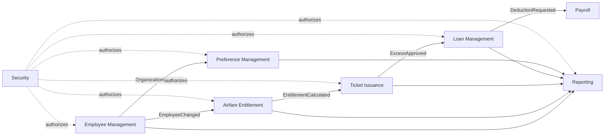
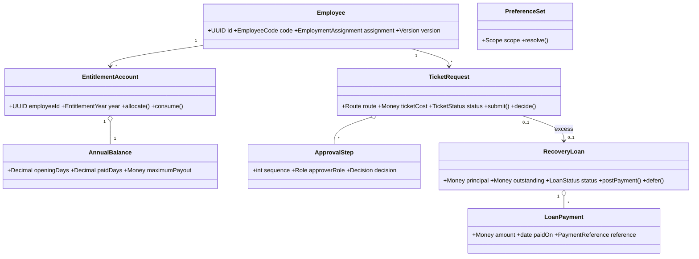

# Phase 2 — Domain Modeling

## Strategic design

The source currently contains four dataclass aggregates (`Employee`, `OpeningBalance`, `Ticket`, `Loan`) and pure services in `domain/services.py`; most operational behavior remains in `api/main.py`. The target separates seven bounded contexts and exchanges immutable events through an outbox.

## Tactical catalog

### Employee Management
- Aggregate: `Employee`; entities: Employee, EmploymentAssignment; value objects: EmployeeCode, CompanyId, OrganizationPath, EmploymentPeriod, Email.
- Events: EmployeeRegistered, EmployeeAssignmentChanged, EmployeeDeactivated, EmployeeTerminated.
- Domain services: eligibility-at-date; repositories: EmployeeRepository, CompanyRepository; application services: RegisterEmployee, ImportEmployees, ChangeAssignment, DeactivateEmployee.
- Current: `employees`, `companies`, `/v1/employees`; assignment is flattened into strings and Company is only an ORM row.

### Airfare Entitlement
- Aggregate: `EntitlementAccount`; entities: AnnualBalance, Allocation, Consumption; value objects: EntitlementYear, ServiceDays30_360, EntitlementDays, Money, PolicyVersion.
- Events: OpeningBalanceEstablished, EntitlementAllocated, EntitlementConsumed, EntitlementReinstated.
- Services: AccrualCalculator, CarryForwardPolicy, TaxEligibilityPolicy; repositories: EntitlementAccountRepository, PolicyRepository; applications: PreviewEntitlement, AllocateEntitlement, ImportOpeningBalances, CloseEntitlementYear.
- Current: `opening_balances` and pure preview only; no persisted allocation ledger or effective-dated policy.

### Ticket Issuance
- Aggregate: `TicketRequest`; entities: ApprovalStep, Traveler, RouteLeg, Evidence; value objects: AirportCode, Route, TicketCost, ApprovalDecision, WorkflowVersion.
- Events: TicketDrafted, TicketSubmitted, TicketApproved, TicketRejected, TicketPaid, TicketReversed, ExcessIdentified.
- Services: ApprovalChainResolver, FareCapValidator, ExcessCalculator; repositories: TicketRepository, AttachmentRepository; applications: CreateTicket, SubmitTicket, DecideApproval, MarkPaid, ReverseTicket.
- Current: `tickets`, `attachments`, a fixed status map in `api/main.py:671-677`; no approval-step entity or traveler/leg model.

### Loan Management
- Aggregate: `RecoveryLoan`; entities: Installment, Payment, Deferment, PayrollInstruction; value objects: Principal, InterestRate, Tenor, DueDateAnchor, PaymentReference.
- Events: LoanCreated, LoanDeferred, LoanResumed, PaymentPosted, LoanSettled, LoanWrittenOff.
- Services: EmiCalculator, ScheduleBuilder, DefermentPolicy, SettlementService; repositories: LoanRepository, PayrollInstructionRepository; applications: CreateLoanFromExcess, PreviewLoan, PostPayment, DeferLoan, ExportPayroll.
- Current: `loans`/`loan_payments`; schedule is generated, not persisted; no defer/resume endpoint.

### Preference Management
- Aggregate: `PreferenceSet`; entities: PreferenceEntry, ConditionalFormatRule; value objects: Scope, PreferenceKey, JsonValue, RulePredicate, StyleToken.
- Events: PreferenceChanged, PreferenceLocked, RulePublished; service: PreferenceResolver/RuleEvaluator; repository: PreferenceRepository; applications: UpsertPreference, ResolveEffectivePreferences, ValidateRules.
- Current: one `preferences` table and `resolve_preferences`; `is_locked` is stored but not enforced.

### Reporting
- Aggregate: `ReportJob`; entities: ReportArtifact, ExportManifest; value objects: ReportType, FilterSet, ContentHash, RetentionDate.
- Events: ReportRequested, ReportCompleted, ReportFailed, ArtifactExpired; services: SnapshotQuery, Renderer; repositories: ReportJobRepository; applications: RequestReport, DownloadReport.
- Current: synchronous excess PDF and employee XLSX; no job or artifact persistence.

### Security
- Aggregates: UserAccount, RefreshSession, RoleAssignment; entities: PasswordHistory, LoginAttempt; value objects: Username, PasswordHash, Permission, TokenId, TenantScope.
- Events: LoginSucceeded/Failed, AccountLocked, PasswordChanged, RefreshTokenRotated, RoleGranted/Revoked.
- Services: Authentication, AuthorizationPolicy, TokenRotation, AuditRedaction; repositories: UserRepository, SessionRepository; applications: Login, Refresh, Logout, ChangePassword, AdministerRoles.
- Current: `users`, `refresh_tokens`, `password_history`, lockout fields, token-family rotation/reuse handling and local password change exist. Company/organization scope, permission entities, OIDC/MFA and access-token revocation checks do not.

## Core class model

## Aggregate and transaction rules

Only aggregate roots are repositories. Ticket status and approvals update atomically; loan payment and outstanding update atomically; entitlement consumption and ticket approval share one local transaction or an idempotent saga. Cross-context events are written to an outbox in the same commit and dispatched asynchronously. Reporting never mutates source aggregates.

## Context integration contracts

Events carry `event_id`, `aggregate_id`, `aggregate_version`, `occurred_at`, `actor_id`, `company_id`, `correlation_id`, and schema version. Consumers deduplicate by event ID. Employee Management is authoritative for organization and status; Entitlement owns calculations and balances; Ticket owns approval state; Loan owns debt. No context writes another context’s tables.

## Current vs target gaps

`application/contracts.py` exposes only an employee repository/UoW and an in-process event bus. API handlers directly manipulate ORM rows for all other contexts, domain events are not durable, and there is no approval/outbox model. `entitlement_rates` is an effective-dated rate store but is not yet connected to the preview calculation. Target services must move invariants out of route functions without creating circular imports.
