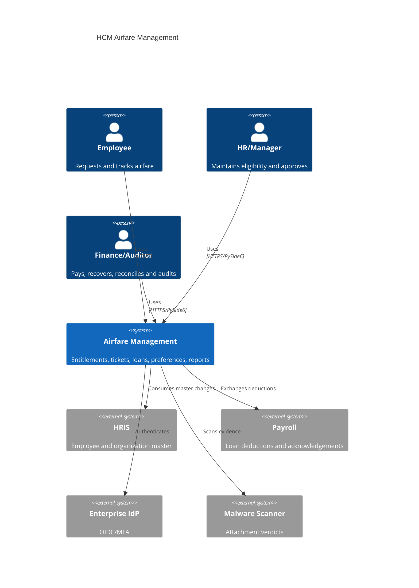
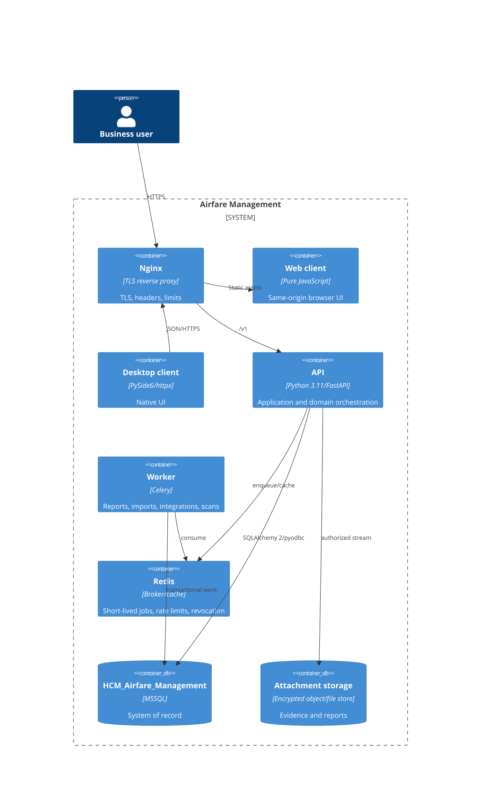
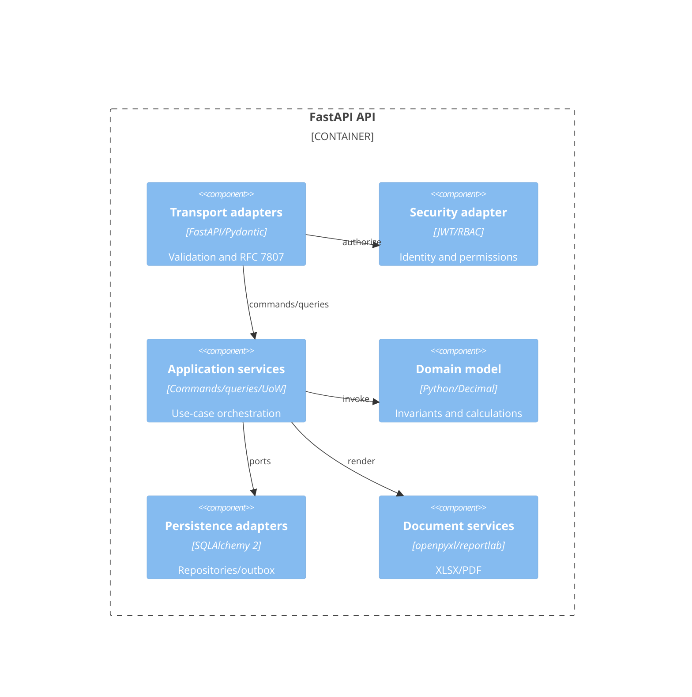
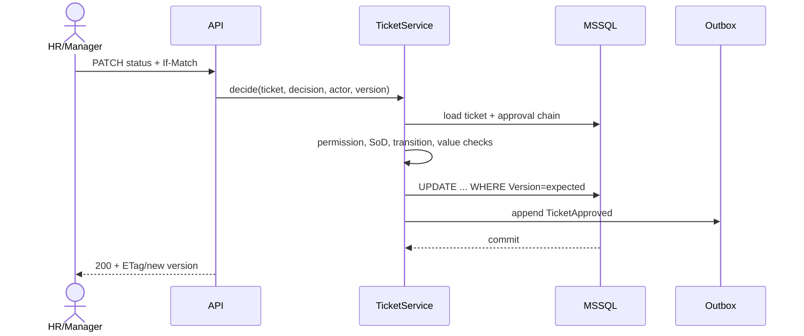

# Phase 3 — Enterprise Architecture

## C4 context



## Containers



Current `compose.yaml` contains only the API and attachment volume. Redis, Celery and Nginx are target containers, not deployed components.

## API component view



## Key sequences



```mermaid
sequenceDiagram
  participant P as Payroll
  participant A as Integration API
  participant L as LoanService
  participant D as MSSQL
  P->>A: deduction callback + idempotency key
  A->>D: lookup InboxMessage
  alt duplicate
    D-->>A: prior response
  else new
    A->>L: post payment
    L->>D: lock loan; payment + outstanding + audit
    D-->>A: commit
  end
  A-->>P: acknowledgement
```

## Deployment and operations

Nginx terminates TLS, sets HSTS/CSP, limits bodies/rates and forwards verified proxy headers. API and workers run as non-root immutable containers. MSSQL is private-network only. Redis requires TLS/auth and is not the source of record. Secrets come from a vault/managed identity, never image or source. OpenTelemetry exports traces; Prometheus-compatible metrics cover latency, queue depth, DB pools and workflow failures.

## Architecture decisions and trade-offs

- Modular monolith first: one transactional MSSQL boundary fits coupled entitlement/ticket/loan consistency and team size. Reject microservices now because distributed transactions and operational overhead exceed independent-scaling value.
- SQLAlchemy repositories: portability and testability, while allowing targeted MSSQL SQL for locking/temporal features. Reject active-record route logic as the target because it scatters invariants.
- Celery/Redis for slow/retriable jobs, never synchronous financial mutation. Reject in-process background tasks because restart loses work.
- MSSQL temporal history plus application audit: temporal answers “what row existed”; audit answers “who/why/request.” Either alone is insufficient.
- Same versioned API for web and desktop. Reject desktop direct DB connectivity because it bypasses authorization/audit.
- HS256 is acceptable only for a tightly controlled single issuer; target OIDC/RS256 or asymmetric internal signing improves rotation and key separation.

## Current vs target gaps

The present FastAPI module is a 923-line composition-and-use-case file, reports/imports execute in request threads, attachments use local disk, and events are synchronous/in-memory. The target introduces application boundaries, durable outbox, asynchronous workers, reverse proxy, centralized identity and operational telemetry without changing the documented business semantics.
