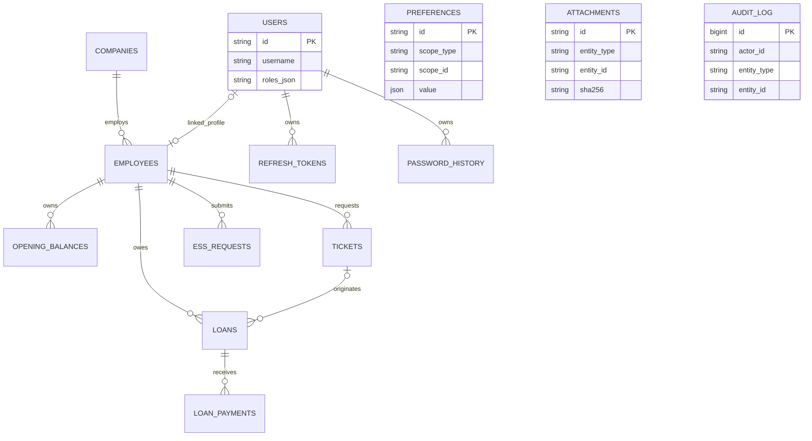

# Phase 4 — Database Engineering

## Actual persisted model

Alembic `0001_initial.py` creates `employees` and `audit_log`; `0002_operational_modules.py` creates `companies`, `users`, `opening_balances`, `tickets`, `loans`, `loan_payments`, `preferences`, and `attachments`; `0003_enterprise_workflows.py` adds `refresh_tokens`, `password_history`, `lookups`, `entitlement_rates`, and `ess_requests` and enriches audit columns. Runtime ORM names are lowercase default-schema tables. `sql/mssql_schema.sql` is a separate reference DDL under schema `airfare`; it is not equivalent to the Alembic schema.

`attachments.entity_id` and `preferences.scope_id` are polymorphic identifiers and therefore have no foreign keys. The current ORM now declares Employee → Company, but `0003` does not add that FK to an existing `0001` database; deployment reconciliation must verify it is trusted.

## DDL conformance matrix

Target for mutable business tables is `CreatedAt`, `UpdatedAt`, `CreatedBy`, `UpdatedBy`, `DeletedAt`, positive `Version`, and temporal history. Append-only event/payment/audit tables may omit update/delete/version but require creator and immutable retention controls.

| Table | Current source/deployment conformance |
|---|---|
| `companies`, `users`, `employees`, `opening_balances`, `tickets`, `loans`, `preferences`, `attachments` | ORM now carries creation/update actor/time, soft delete and version; no Alembic temporal history. |
| `loan_payments` | ORM now carries full mutable metadata, but target should treat payments as immutable/reversible and add idempotency. |
| `refresh_tokens`, `password_history`, `lookups`, `entitlement_rates`, `ess_requests` | `0003` creates full audit/version columns; no temporal history. |
| `audit_log` | Append-only target; `0003` adds IP/session/changes but no immutable trigger or before/after schema. |

The reference `mssql_schema.sql` lacks all five `0003` tables, CreatedBy/UpdatedBy everywhere, temporal history except Companies/Employees, and full mutable metadata. It also omits `PaidDays`, `MonthlyInstallment`, `FirstDueDate`, ticket `Notes`/`ExcessHandling`, proving schema drift. A verification run on 2026-08-17 failed during import because deployed `companies` lacked `updated_at`, `created_by`, `updated_by`, `deleted_at`, and `version` expected by current ORM; migration/runtime state was not synchronized.

## Target relational additions

Add `ApprovalChains`, `ApprovalSteps`, `TicketApprovals`, `EntitlementAllocations`, `LoanDeferments`, `PayrollInstructions`, `IntegrationInbox`, `OutboxMessages`, `LoginAttempts`, `ReportJobs`, and `ConditionalFormatRules`. Current `refresh_tokens` and `password_history` cover local session/password lifecycle. Every FK uses the same `uniqueidentifier` representation; organization scope should be normalized (Company/Branch/Department) or constrained through a validated scope registry.

## Integrity and indexes

- Filtered unique: Employee `(CompanyId, Code) WHERE DeletedAt IS NULL`; OpeningBalance `(EmployeeId, BalanceYear)`; Preference `(ScopeType, ScopeId, PreferenceKey)`.
- Ticket work queue: `(CompanyId, Status, UpdatedAt)` include employee, travel date, amount, version.
- Loan payroll queue: `(Status, DeferredUntil, NextDueDate)` include employee, outstanding, installment.
- Payment idempotency: unique `(SourceSystem, Reference)`; do not rely on free-text `reference`.
- Audit: `(EntityType, EntityId, OccurredAt DESC)` and `(CorrelationId)`; history `(ValidTo, ValidFrom, Id)`.
- Search: measured normalized code/name indexes; avoid leading-wildcard scans or add SQL full-text/search projection.
- All checks in reference DDL must move into Alembic: status enums, non-negative amounts, route inequality, positive version.

Index changes require Query Store evidence, online/resumable build where edition supports it, and regression checks for write amplification.

## Partition and retention strategy

Do not partition small operational tables. At sustained history/audit volume above roughly 50–100 million rows, monthly partition `AuditLog` on `OccurredAt` and temporal history on `ValidTo`; pre-create next boundary and use aligned indexes. Sliding-window archive is approved by Records Management and preserves legal holds. Operational Tickets/Loans remain unpartitioned unless measured data distribution proves benefit.

## Audit decision

Use both system-versioned temporal tables for mutable financial/master rows and append-only `AuditLog` for intent. Temporal history reliably captures DB state even outside the application; audit captures actor, permission, reason, correlation, IP and redacted before/after. Protect audit with deny update/delete plus trigger, separate writer role, hash-chain or immutable export for tamper evidence. Never store passwords, JWTs, attachment bytes, or unrestricted PII in audit JSON.

## Backup and disaster recovery

- Encrypted weekly full, daily differential, transaction-log every 5–15 minutes; checksum and restore verification.
- 35-day operational retention, monthly 13 months, annual 7 years unless jurisdiction requires otherwise; immutable off-site copy.
- Always On Availability Group or equivalent for HA; asynchronous regional replica for disaster recovery.
- RPO ≤15 minutes; RTO ≤4 hours. Quarterly point-in-time restore and annual region failover measure actual objectives.
- Run `DBCC CHECKDB`, monitor backup age/failures, test key recovery, script login/job recreation, and document DNS/application failback.

## Concurrency and transaction isolation

Enable `READ_COMMITTED_SNAPSHOT` for read scalability. Use SQLAlchemy version columns on every mutable aggregate and `UPDATE ... WHERE Version=:expected`. Loan payment and outstanding update require one transaction with row lock or compare-and-swap; opening-balance import uses staged validation and set-based atomic merge. Deadlocks are retried only for idempotent commands.

## Current vs target gaps

The production migration path still does not implement the reference `airfare` schema, temporal history, reference checks, or filtered indexes/checks consistently. `0003` improves metadata but the failed verification proves it was not applied successfully to the live database before updated ORM startup. Treat `mssql_schema.sql` as design documentation until Alembic safely converges and catalog checks pass.
