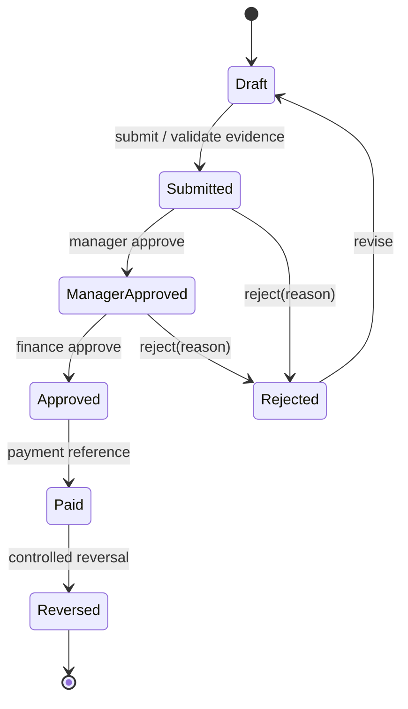
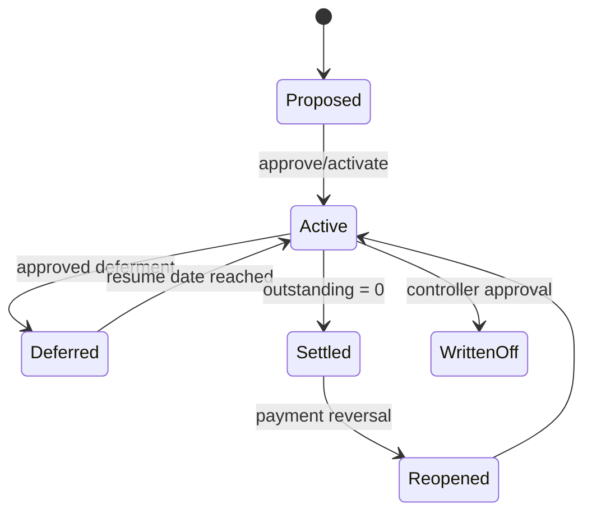
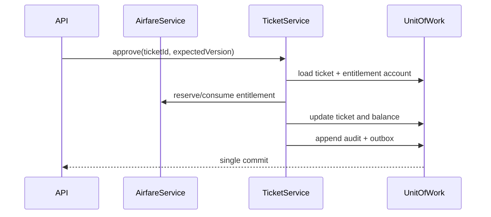

# Phase 8 — Service Design

## Service responsibilities

| Service | Owns | Key operations |
|---|---|---|
| EmployeeService | Company/employee master boundary | register, import, change assignment/status, eligibility lookup |
| AirfareService | Opening balances, allocation ledger, calculation | establish balance, preview/allocate/consume/reinstate, year close |
| TicketService | Ticket, approvals and evidence links | draft, submit, decide, pay, reverse, identify excess |
| LoanService | Loan, schedule, deferment and payments | create, preview, activate, defer/resume, post/reverse payment, settle |
| PreferenceService | Scoped configuration and format rules | upsert/lock, resolve, validate/publish rules |
| ReportService | Read models and artifacts | request, render, authorize download, expire |
| AuditService | Immutable intent/security log | append in transaction, query by permission, export to SIEM |

These are modules within a modular monolith initially, not separately deployed network services.

## Ticket approval state machine



The current fixed model collapses manager and finance approvals into `approved`; target approval chains are policy-driven and record each step. The legacy transition remains supportable as a one-step chain.

## Loan lifecycle



## Transaction sequences



```mermaid
sequenceDiagram
  participant API
  participant L as LoanService
  participant DB as UnitOfWork
  API->>L: postPayment(command, idempotencyKey)
  L->>DB: find inbox key
  L->>DB: lock/compare loan version
  L->>DB: insert payment; decrement outstanding
  L->>DB: settle if zero; audit; outbox
  DB-->>API: commit + new version
```

## Unit of Work rules

1. One command, one local database transaction; validation reads that affect the decision occur inside it.
2. Repositories expose aggregates, not query-building internals. Read-only reports use dedicated projections and no tracked entities.
3. `flush` is not success; events publish only after commit through an outbox. External calls never occur inside a DB transaction.
4. Every mutable command carries actor, tenant, correlation, expected version and idempotency key where retryable.
5. Ticket approval plus entitlement consumption is atomic. Loan payment plus outstanding/status/audit is atomic. Import commit is atomic per approved batch.
6. Isolation defaults to read-committed snapshot; use compare-and-swap or update locks on financial aggregates. Never retry a non-idempotent command blindly.
7. Audit/outbox failure fails the business transaction. Post-commit notification failure retries independently.

## Error handling

Domain errors are stable and transport-neutral: validation, forbidden transition, policy violation, stale version, duplicate and not found. Application services translate infrastructure exceptions to unavailable/conflict without leaking SQL. API maps errors to the common problem contract and logs stack traces only server-side with correlation. Celery classifies transient (timeout/deadlock/503), permanent (validation/authorization) and poison messages; exponential backoff with jitter, retry caps and dead-letter review. Compensation is explicit—never “undo” by deleting financial records.

## Service-specific invariants

- EmployeeService: active company and unique active code; termination blocks future request submission but preserves history.
- AirfareService: no negative balances/payout; policy version and calculation inputs are persisted for reproducibility.
- TicketService: submitter cannot approve; approval uses current entitlement reservation; paid requires finance reference.
- LoanService: source ticket excess cannot be financed twice; payment cannot exceed outstanding; deferment does not silently capitalize interest.
- PreferenceService: locked ancestor wins; security policy is never a user preference; JSON conforms to a versioned schema.
- ReportService: query is tenant-scoped and repeatable as-of a cutoff; artifact has checksum, owner, expiry and access audit.
- AuditService: append-only, redacted, and unable to recursively audit itself.

## Integration reliability

Use transactional outbox for HRIS/payroll/notifications and an inbox unique on `(source, message_id)`. Exports include period, sequence, count and monetary control totals. Callbacks use mTLS/signatures and return the same response for duplicates. Circuit breakers stop dependency cascades; reconciliation compares accepted instructions with posted payments.

## Current vs target gaps

Operational services currently live directly in FastAPI handlers; only employee has repository/UoW ports. The in-process `EventBus` publishes after employee commit but is lossy on process failure. Defer/restructure use If-Match, but individual payment and bulk settlement still lack expected versions/idempotency. Entitlement rates are persisted yet preview does not resolve them or persist policy/calculation evidence. The target should be introduced module by module behind existing routes.
