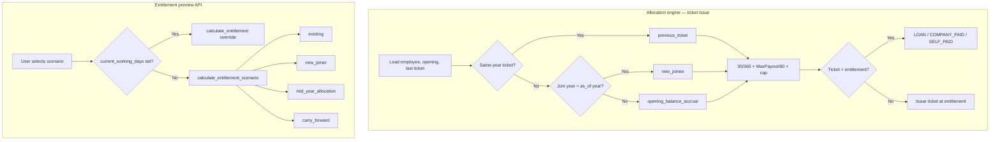

# HCM Airfare — Scenarios & Calculation Logic

Canonical implementation: `src/airfare_management/domain/services.py`

This document describes **all scenario types**, how they are selected, and the formulas
applied. Production ticket issuance uses the **ATLAS 30/360 + 60-day cycle** engine
(`MaxPayout ÷ 60`). See also [`allocation-engine-source-of-truth.md`](allocation-engine-source-of-truth.md).

---

## Overview: two scenario systems

| System | API | Scenario selection | Primary use |
|--------|-----|-------------------|-------------|
| **Allocation engine** | `POST /v1/allocations/preview`, `POST /v1/allocations/issue` | Auto-detected from employee + ticket history | Issue tickets, loans, excess handling |
| **Entitlement preview** | `POST /v1/entitlements/preview` | Explicit `scenario` field in request body | Side-effect-free what-if calculations |

Both systems share constants:

| Constant | Value | Meaning |
|----------|-------|---------|
| `AIRFARE_CYCLE_DAYS` | 60 | Full entitlement cycle |
| `DEFAULT_AIRFARE_POLICY_AMOUNT` | 150 | Default MaxPayout when rate ≤ 0 |
| `WORKING_DAYS_PER_AIRFARE_DAY` | 30 | Denominator for accrual |
| `AIRFARE_DAYS_PER_MONTH` | 2.5 | Accrued days per 30 working days |

---

## Part 1 — Allocation scenarios (ticket issue)

Enum: `AllocationScenario` in `domain/services.py`

| Scenario | Value | When it applies |
|----------|-------|-----------------|
| Previous ticket | `previous_ticket` | Employee has a ticket in the **same calendar year** as `as_of_date` |
| New joinee | `new_joinee` | No same-year ticket, and **join year = as_of year** |
| Opening balance accrual | `opening_balance_accrual` | No same-year ticket, employee joined **before** as_of year |

### Auto-detection logic

```text
if last_ticket_date is not None AND last_ticket_date.year == as_of_date.year:
    scenario = PREVIOUS_TICKET
elif date_of_joining.year == as_of_date.year:
    scenario = NEW_JOINEE
else:
    scenario = OPENING_BALANCE_ACCRUAL
```

Tickets from prior years are ignored for scenario detection (treated as no previous ticket).

### Accrual start date (all allocation scenarios)

```text
start = max(
    1 January of as_of year,
    date_of_joining,
    last_ticket_date + 1 day   # if same-year ticket exists
)
```

Function: `_accrual_start()` → field `accrual_start` on the preview response.

### Shared calculation pipeline

Function: `calculate_allocation_entitlement()`

```text
1. MaxPayout = resolved airfare rate (default 150 if rate ≤ 0)
2. per_day = MaxPayout / 60
3. working_days = allocation_working_days(as_of, year, DOJ, last_ticket)
4. accrued_days = ROUND(working_days / 30 × 2.5, 4)
5. opening_amount_used = opening_balance_amount
      OR fn_atlas_airfare_amount(opening_days) when amount is 0 but days > 0
6. current_year_amount = ROUND(per_day × accrued_days, 2)
7. total = min(MaxPayout, opening_amount_used + current_year_amount)
8. paid_amount = ROUND(paid_days × per_day, 2) + current_year_spending
9. policy = max(0, total − paid_amount)          ← calculated entitlement
10. remaining_days = min(60, policy / per_day)
11. final_entitlement = min(policy, cap_rate)     ← after Max_Entitlement_Cap
```

### 30/360 working days

Function: `allocation_working_days()`

```text
start = max(1 Jan of year, join_date, previous_ticket_date + 1)
start_serial = (start.month − 1) × 30 + start.day
end_serial   = (as_of.month − 1) × 30 + as_of.day
working_days = min(360, max(0, end_serial − start_serial + 1))
```

If `as_of.year < allocation_year` → 0 days.  
If `as_of.year > allocation_year` → 360 days.

### Airfare amount from days

Function: `fn_atlas_airfare_amount()` — port of `dbo.fn_ATLAS_AirfareAmount`

```text
days_capped = min(60, max(0, closing_days))
amount = ROUND((MaxPayout / 60) × days_capped, 2)
```

### Rate hierarchy (MaxPayout resolution)

Function: `resolve_airfare_rate_hierarchy()`

| Priority | Source | Field |
|----------|--------|-------|
| 1 | Employee custom rate | `employee.custom_airfare_rate` |
| 2 | Pay group rate | entitlement rate scoped to pay group |
| 3 | Company rate | company-level policy |
| 4 | Global preference | `global_company_preference_rate` (default 150) |

Cap hierarchy (`resolve_entitlement_cap()`): employee → pay group → company → global.

### Scenario behaviour notes

**Previous ticket (`previous_ticket`)**  
Accrual restarts the day after the last same-year ticket. Opening balance days/amount
still participate in the total, but the **working-day window** starts after the ticket.

**New joinee (`new_joinee`)**  
Same ATLAS math; accrual start is typically the join date (if in the as_of year).
Detected when join year equals as_of year and no same-year ticket exists.

**Opening balance accrual (`opening_balance_accrual`)**  
Standard year-to-date accrual from 1 January (or join date if later). Used for
tenured employees without a same-year ticket.

### Worked example (previous ticket)

From `tests/test_airfare_allocation_engine.py::test_scenario_1_previous_ticket_ignores_opening_balance`:

- Employee joined 2020; opening 20 days / 50 BHD
- Ticket issued **2026-01-01**
- Preview on **2026-06-15** → `previous_ticket`
- Accrual starts **2026-01-02** (not from opening balance alone)
- Working days = 30/360 from Jan 2 → Jun 15
- Entitlement = policy after per_day accrual, capped by MaxPayout and cap rate

---

## Part 2 — Entitlement preview scenarios

Enum: `EntitlementScenario`  
API: `POST /v1/entitlements/preview`  
Request model: `EntitlementRequest` in `api/main.py`

| Scenario | Value | Required inputs | Logic path |
|----------|-------|-----------------|------------|
| Existing | `existing` | opening_days, paid_days, maximum_payout, target_date, allocation_year | 30/360 + standard entitlement formula |
| New joiner | `new_joiner` | **join_date** (required) | Calendar-day proration (365/366) |
| Mid-year allocation | `mid_year_allocation` | **previous_allocation_date** (required) | 30/360 from day after allocation; **opening forced to 0** |
| Carry forward | `carry_forward` | carry_forward_cap (default 30) | Cap opening days, then existing path |

### Manual override (not an enum)

If `current_working_days` (0–360) is supplied, scenario logic is **skipped** and
`calculate_entitlement()` runs directly with that override.

### Standard entitlement formula

Function: `calculate_entitlement()` — used by `existing`, `carry_forward`, and override

```text
current   = (working_days / 30) × 2.5
remaining = min(60, max(0, opening_days + current − paid_days))
payable   = min(maximum_payout, maximum_payout / 60 × remaining)
```

### New joiner (preview-only path)

Function: `calculate_entitlement_scenario()` when `scenario = new_joiner`

```text
start = max(join_date, 1 Jan of allocation_year)
end   = min(target_date, 31 Dec of allocation_year)
service_days = (end − start).days + 1

denominator = 366 if leap year else 365
current   = service_days / denominator × 30
remaining = min(60, max(0, current − paid_days))
payable   = min(maximum_payout, maximum_payout / 30 × remaining)
```

> **Note:** This preview path uses calendar/365 math. The **allocation engine** still
> labels `new_joinee` but uses ATLAS 30/360 for ticket issue (see intentional alignment
> in `allocation-engine-source-of-truth.md`).

### Mid-year allocation

```text
adjusted_opening = 0
working_days = allocation_working_days(..., previous_allocation_date)
→ calculate_entitlement(0, working_days, paid_days, maximum_payout)
```

### Carry forward

```text
adjusted_opening = min(opening_days, carry_forward_cap)
→ calculate_entitlement(adjusted_opening, working_days, paid_days, maximum_payout)
```

---

## Part 3 — Excess settlement options

Enum: `ExcessSettlementOption`  
Function: `settle_excess_ticket()`

Triggered when `requested_ticket_amount > final_entitlement_amount`:

```text
excess = max(0, requested_ticket_amount − final_entitlement_amount)
```

| Option | Value | Employee pays | Company pays | Loan |
|--------|-------|---------------|--------------|------|
| Loan | `LOAN` | Excess | Final entitlement | Yes — principal = excess, EMI = `ROUND(excess / tenure, 2)` |
| Company paid | `COMPANY_PAID` | 0 | Full ticket amount | No |
| Self paid | `SELF_PAID` | Excess | Final entitlement only | No |

When excess = 0, company pays `min(ticket, entitlement)` regardless of option.

Loan EMI uses `fn_atlas_loan_emi()` — port of `dbo.fn_ATLAS_LoanEMI`:

```text
EMI = ROUND(amount / tenure_months, 2)   # zero rate; equal instalments
```

For amortizing loans with interest, see `calculate_emi()` and `build_amortization_schedule()`.

---

## Flow diagram



---

## API quick reference

| Endpoint | Scenario input | Output highlights |
|----------|----------------|-----------------|
| `POST /v1/allocations/preview` | Auto (from employee_id + dates) | `scenario`, `accrued_days`, `final_entitlement_amount`, `daily_rate`, excess preview |
| `POST /v1/allocations/issue` | Auto + `excess_option` | Persists ticket; optional loan on `LOAN` |
| `POST /v1/entitlements/preview` | `scenario` enum + fields | `current_days`, `remaining_days`, `payable` |

---

## Related tests

| File | Coverage |
|------|----------|
| `tests/test_airfare_allocation_engine.py` | Scenarios 1–3 via allocation API |
| `tests/test_allocation_logic.py` | Formula parity with ATLAS reference |
| `tests/unit/test_allocation_engine.py` | Pure domain unit tests |
| `tests/unit/test_opening_balance.py` | Leap year, cap enforcement |
| `tests/property/test_allocation_properties.py` | Hypothesis invariants |

---

## References

- [`allocation-engine-source-of-truth.md`](allocation-engine-source-of-truth.md) — ATLAS reverse engineering, port 3389 alignment
- [`phase-06-api-design.md`](phase-06-api-design.md) — entitlement preview contract
- `sql/mssql_procedures.sql` — `fn_HCM_AirfareAmount` (MaxPayout / 60 × days)
